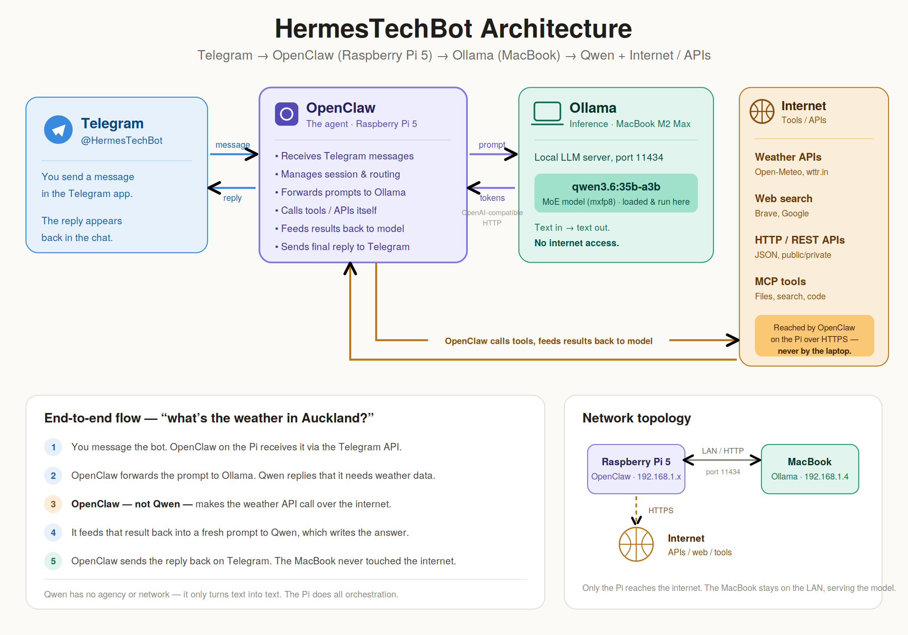

# OpenClaw on a Raspberry Pi 5 — A Real Setup Guide

Running a personal AI agent 24/7 on a Raspberry Pi 5: it chats over Telegram, calls tools and the
internet itself, offloads inference to a local Ollama model on a beefier machine, and runs scheduled
jobs that post digests on their own. This repo is the **canonical reference** for how it was built —
including the dead ends, not just the happy path.

> **Author:** Senthil · **Hardware:** Raspberry Pi 5 (16 GB, Debian 13 Trixie) + Ollama on a MacBook
> M2 Max (96 GB) · **OpenClaw:** 2026.6.10

---

## Architecture



**Telegram → OpenClaw on the Pi → Ollama on the MacBook → Qwen + Internet/APIs.**

The split is the whole point:

- **OpenClaw on the Pi** is the agent and orchestrator. It receives Telegram messages, manages the
  session, decides what to do, and makes **every** tool, API, and internet call itself.
- **Ollama on the MacBook** (M2 Max, 96 GB) does **inference only** — it runs `qwen3.6:35b-a3b`
  (mxfp8) and never touches the internet. The Pi reaches it over OpenAI-compatible HTTP on the LAN.
- The model the agent *picks* is layered: a cloud primary for quality, falling back to that free
  local model and then to cheap cloud models if the primary is unavailable.

**End-to-end, "what's the weather in Auckland?":** you message the bot → the Pi forwards the prompt
to Qwen → Qwen says it needs weather data → **the Pi (not Qwen)** makes the weather API call → it
feeds the result back to Qwen, which writes the answer → the Pi replies on Telegram. The MacBook
never left the LAN.

| Tier | Model | Where | Cost |
|------|-------|-------|------|
| **Primary** | `deepseek/deepseek-v4-pro` | Cloud | paid |
| Fallback 1 | `ollama/qwen3.6:35b-a3b-mxfp8` | Local LAN | free |
| Fallback 2 | `google/gemini-2.5-flash-lite` | Cloud | cheap |
| Fallback 3 | `huggingface/zai-org/GLM-5.2:novita` | Cloud | free tier |

---

## The guide

Read it in order, or jump to what you need:

1. **[Raspberry Pi 5 — headless setup](docs/01-pi-setup.md)** — SSH keys, hostname/mDNS, an `ssh pi`
   alias, the host-key fix, Bluetooth pairing, connectivity checks.
2. **[Installing & wiring OpenClaw](docs/02-openclaw-setup.md)** — Node 24 → OpenClaw → Telegram
   pairing → wiring Ollama → the model fallback chain → plugins → skills (the real journey).
3. **[Config files explained](docs/03-config-files.md)** — `openclaw.json` vs the per-agent
   `models.json`, the `providers` block, the allowlist vs. `model.primary`/`fallbacks`, and `.env`
   references.
4. **[Cron jobs — proof it works](docs/04-cron-jobs.md)** — the scheduled digests, per-job model
   pinning, the explicit-timezone gotcha, and migrating off OS crontab.
5. **[Skills guide](docs/05-skills.md)** — `youtube-full` vs `youtube-watcher`, weather, stock
   analysis, and the `uv`/`yt-dlp` dependency.
6. **[Troubleshooting](docs/06-troubleshooting.md)** — every real error from this build, with cause
   and fix.

**Config templates:** [`examples/openclaw.json.example`](examples/openclaw.json.example) ·
[`examples/.env.example`](examples/.env.example)

---

## Quickstart

The thirty-second version. Each step links to the full walkthrough.

```bash
# 1. On a headless Pi you can `ssh pi` into — see docs/01
sudo apt update && sudo apt full-upgrade -y

# 2. Node 24 + OpenClaw — see docs/02
curl -fsSL https://deb.nodesource.com/setup_24.x | sudo -E bash -
sudo apt install -y nodejs jq
curl -fsSL https://openclaw.ai/install.sh | bash

# 3. Configure
cp examples/openclaw.json.example ~/.openclaw/openclaw.json   # then edit
cp examples/.env.example          ~/.openclaw/.env            # then fill in real keys
#    edit the Ollama baseUrl (OLLAMA_HOST_IP) and workspace path (USER) in openclaw.json

# 4. Start, pair Telegram, verify
npx openclaw gateway restart
npx openclaw pairing approve telegram <PAIRING-CODE>   # code shown when you message your bot
npx openclaw doctor --fix
npx openclaw logs --follow
```

---

## Proof it works

Two scheduled jobs run unattended and post into a Telegram group — the clearest sign the whole stack
is alive:

| Job | Schedule | Model | → |
|-----|----------|-------|---|
| **Daily GitHub Trends digest** | `30 9 * * *` Pacific/Auckland | `ollama/qwen3.6:35b-a3b-mxfp8` (free, local) | Telegram group |
| **Weekly AI & Tech Earnings** | `0 7 * * 6` Pacific/Auckland | `ollama/qwen3.6:35b-a3b-mxfp8` (free, local) | Telegram group |

The neat trick: cron jobs **pin their own model** independent of the interactive primary, so all this
background work runs on the *free local* Qwen while live chat stays on the cloud model. Details and
the OS-crontab migration in **[docs/04](docs/04-cron-jobs.md)**.

---

## Security & secrets

This setup runs on the principle that **no secret is ever committed or hardcoded**.

- **Keys live in `~/.openclaw/.env`**, referenced from `openclaw.json` by name (`$DEEPSEEK_API_KEY`,
  `$TELEGRAM_BOT_TOKEN`, `$HF_TOKEN`, `$BRAVE_API_KEY`, `$OPENCLAW_GATEWAY_TOKEN`, …) — never inline.
- **The committed `.gitignore`** ignores the real `.env` and `openclaw.json` (and `*.bak`, `*.log`,
  SSH keys), while allowing the `*.example` templates. Only sanitised examples ship in this repo.
- **The gateway binds to loopback only** with token auth — it is not exposed to the LAN by default.
- **If a secret ever lands in a commit, rotate it.** Removing it from the latest file is not enough —
  it stays in git history (and may already be cached/indexed). Revoke and reissue the token instead.

> The IPs, username, hostname, Bluetooth MAC, and Telegram IDs in this guide are placeholders
> (`<user>`, `<pi-host>`, `<ollama-ip>`, `OLLAMA_HOST_IP`, `123456789`, …). Substitute your own.

---

## Further reading & attribution

- [Wagner's TechTalk — OpenClaw Raspberry Pi 5 install guide](https://toucancreator.com/learn/wagner-s-techtalk/tutorial/openclaw-raspberry-pi-5-installation-guide)
- [OpenClaw Gemini search docs](https://docs.openclaw.ai/tools/gemini-search)
- [Raspberry Pi — getting started](https://www.raspberrypi.com/documentation/computers/getting-started.html)
- [awesome-openclaw-usecases](https://github.com/hesamsheikh/awesome-openclaw-usecases) — where the
  digest idea came from
- [Transcript API signup](https://transcriptapi.com/signup) — for the YouTube skills
- [YouTube skills setup walkthrough](https://www.youtube.com/watch?v=NqY0wF4YKXo)

---

*Documents a real, running setup as of June 2026. Adapt the models, channels, and jobs to your own.*
