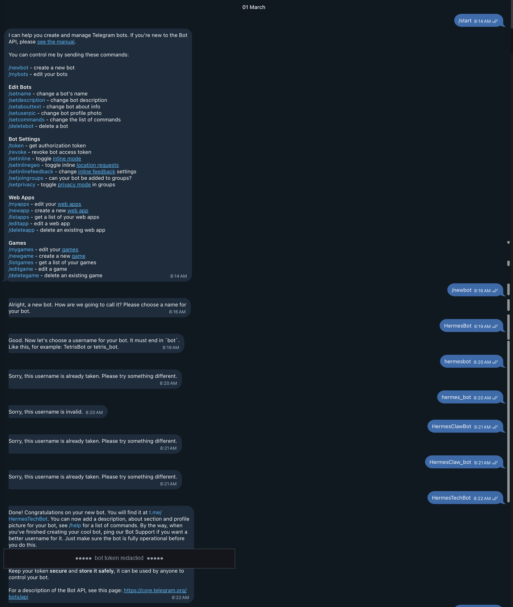

# 2. Installing & Wiring OpenClaw

This is the real journey — Node, then OpenClaw, then Telegram, then pointing the agent at a local
Ollama model, then plugins and skills. It's written in the order it actually happened, dead ends
included, because the dead ends are where the learning is. Where something bit me, there's a link
to **[6. Troubleshooting](06-troubleshooting.md)** with the symptom and the fix.

> Prerequisite: a headless Pi you can `ssh pi` into — see **[1. Pi setup](01-pi-setup.md)**.
> A good companion walkthrough is [Wagner's TechTalk OpenClaw Pi 5 install guide](https://toucancreator.com/learn/wagner-s-techtalk/tutorial/openclaw-raspberry-pi-5-installation-guide).

**The architecture you're building toward:**


Telegram → **OpenClaw on the Pi** (the agent/orchestrator — it makes every tool, API, and internet
call itself) → OpenAI-compatible HTTP → **Ollama on a MacBook** (M2 Max, 96 GB) running
`qwen3.6:35b-a3b` (mxfp8) for inference only. The MacBook never touches the internet; the Pi does
all the orchestration. See **[3. Config files explained](03-config-files.md)** for how the model
fallback chain layers a cloud primary on top of that local model.

---

## 2.1 Install Node.js 24

OpenClaw runs on Node. Install the current LTS line from NodeSource:

```bash
curl -fsSL https://deb.nodesource.com/setup_24.x | sudo -E bash -
sudo apt install -y nodejs
node --version       # v24.x
```

---

## 2.2 Install OpenClaw

```bash
curl -fsSL https://openclaw.ai/install.sh | bash
```

Verify and look around:

```bash
npx openclaw --version       # OpenClaw 2026.6.10
npx openclaw models list
npm root -g                  # where global modules live
```

OpenClaw keeps its state in `~/.openclaw/` — the global config `~/.openclaw/openclaw.json`, your
`~/.openclaw/.env`, the per-agent config under `~/.openclaw/agents/main/agent/`, and your
`~/.openclaw/workspace/`. Those locations matter later, so keep them in mind.

> **Install `jq` now** — you'll be reading and sanity-checking JSON config constantly:
> `sudo apt install -y jq`.

Pick an initial model just to confirm the agent answers (we'll replace this):

```bash
npx openclaw models set google/gemini-2.5-flash-lite
npx openclaw status
npx openclaw tui             # interactive terminal UI — try a prompt
```

---

## 2.3 Pair Telegram

Telegram is the chat front-end. Three steps: create the bot with BotFather, store its token, then
pair it with OpenClaw.

### 2.3.1 Create the bot with BotFather

[@BotFather](https://t.me/BotFather) is Telegram's official bot for making bots. Open a chat with it
and send `/start` to see the command list, then `/newbot` to begin:

```text
You:        /newbot
BotFather:  Alright, a new bot. How are we going to call it?
            Please choose a name for your bot.
You:        HermesBot                    ← display name (anything, shown in chats)

BotFather:  Good. Now let's choose a username for your bot. It must end in `bot`.
            Like this, for example: TetrisBot or tetris_bot.
You:        HermesTechBot                ← username (globally unique, must end in "bot")

BotFather:  Done! Congratulations on your new bot. You will find it at t.me/HermesTechBot.
            Use this token to access the HTTP API:
            123456789:ABCdefGhIJKlmNoPQRstuVwxyZ      ← your bot token (keep secret)
```



*The real exchange. Note the several "username already taken" rejections before `HermesTechBot`
stuck — and that the token (bottom) is redacted here; never share or commit yours.*

Two things trip people up here:

- **The display name and the username are different.** The first prompt is the friendly name shown in
  chats (`HermesBot`); the second is the global handle and **must end in `bot`** (`HermesTechBot`,
  or `hermes_tech_bot`).
- **Good usernames are taken.** Expect a few rounds of *"Sorry, this username is already taken"* (and
  *"this username is invalid"* if it doesn't end in `bot` or uses bad characters) before one sticks —
  it took several tries to land on `HermesTechBot` here. The username can't be changed later without
  asking BotFather's support, so pick one you'll keep.

When it succeeds, BotFather hands you the **HTTP API token** (`123456789:ABC...`). This is the bot's
password — anyone with it can control the bot — so treat it like a secret. If it ever leaks, send
BotFather `/revoke` to invalidate it and issue a new one.

> **Optional polish** (also via BotFather): `/setdescription` and `/setabouttext` for the bot's
> profile, `/setuserpic` for an avatar, and `/setcommands` to register a command menu. `/mybots`
> reopens any bot to edit later.

### 2.3.2 Store the token and enable the channel

Put the token in `~/.openclaw/.env` (never inline in `openclaw.json`):

```bash
# ~/.openclaw/.env
TELEGRAM_BOT_TOKEN=123456789:ABCdefGhIJKlmNoPQRstuVwxyZ
```

Then enable the Telegram channel in `~/.openclaw/openclaw.json` (full block in
[examples/openclaw.json.example](../examples/openclaw.json.example)):

```json
"channels": {
  "telegram": {
    "enabled": true,
    "streaming": { "mode": "off" },
    "groups": { "*": { "requireMention": true } },
    "botToken": "$TELEGRAM_BOT_TOKEN"
  }
}
```

- `streaming.mode: "off"` — send complete replies, not token-by-token typing.
- `groups."*".requireMention: true` — in group chats the bot only answers when @mentioned, so it
  doesn't barge into every conversation.

### 2.3.3 Pair the bot with OpenClaw

Restart the gateway, then message your bot in Telegram. It will surface a one-time **pairing code**;
approve it from the Pi:

```bash
npx openclaw channels list
npx openclaw pairing approve telegram <PAIRING-CODE>
```

Lock the bot down to yourself with `commands.ownerAllowFrom` (your Telegram user ID):

```json
"commands": { "ownerAllowFrom": ["telegram:123456789"] }
```

---

## 2.4 Wire up Ollama (the local model)

Ollama runs on a separate machine with the muscle (here, a MacBook M2 Max). On that machine, pull
the model and expose Ollama on the LAN:

```bash
# On the Ollama host:
ollama pull qwen3.6:35b-a3b-mxfp8
# Expose on the LAN — set in the ollama service environment:
#   OLLAMA_HOST=0.0.0.0:11434
```

From the Pi, confirm you can reach it (this is the OpenAI-compatible endpoint OpenClaw will use):

```bash
curl http://<ollama-ip>:11434/api/tags     # lists installed models
```

> **Gotcha I hit here:** I assumed providers were configured in `~/.openclaw/openclaw.json`, but
> spent a while editing `~/.openclaw/agents/main/agent/models.json` and wondering why nothing
> changed. The two files have different jobs — see
> [Troubleshooting §4: models.json vs openclaw.json](06-troubleshooting.md#4-modelsjson-vs-openclawjson-provider-confusion)
> and [Config files §1](03-config-files.md#31-two-files-two-jobs) for the definitive answer.

Add Ollama as a provider in `openclaw.json` under `models.providers` — note the `/v1` suffix, which
makes it the OpenAI-compatible path:

```json
"ollama": {
  "apiKey": "ollama-local",
  "baseUrl": "http://<ollama-ip>:11434/v1",
  "models": [
    { "id": "qwen3.6:35b-a3b-mxfp8", "name": "qwen3.6:35b-a3b-mxfp8", "contextWindow": 131072 }
  ]
}
```

Restart and tail the logs after every config change — this is the core edit/restart/verify loop:

```bash
npx openclaw gateway restart
npx openclaw logs --follow
npx openclaw doctor --fix      # validates config and fixes common issues
```

> **Tip:** Back up `openclaw.json` before big edits (`cp openclaw.json openclaw.json.bak`) and
> `sdiff` the two if a restart starts failing. `*.bak` is gitignored.

---

## 2.5 Models & providers: the fallback chain

The point of all this wiring is a single resilient model policy: a high-quality cloud model for
interactive chat, with automatic fallback to the free local model (and then cheap cloud models) if
the primary is down or rate-limited.

```json
"agents": {
  "defaults": {
    "model": {
      "primary": "deepseek/deepseek-v4-pro",
      "fallbacks": [
        "ollama/qwen3.6:35b-a3b-mxfp8",
        "google/gemini-2.5-flash-lite",
        "huggingface/zai-org/GLM-5.2:novita"
      ]
    }
  }
}
```

| Tier | Model | Type | Cost |
|------|-------|------|------|
| **Primary** | `deepseek/deepseek-v4-pro` | Cloud API | paid |
| Fallback 1 | `ollama/qwen3.6:35b-a3b-mxfp8` | Local LAN | free |
| Fallback 2 | `google/gemini-2.5-flash-lite` | Cloud API | cheap |
| Fallback 3 | `huggingface/zai-org/GLM-5.2:novita` | Cloud API | free tier |

Every provider's key comes from `~/.openclaw/.env` by reference (`$DEEPSEEK_API_KEY`, `$HF_TOKEN`, …),
never inline. The difference between *which models are allowed* and *which one is chosen* is explained
in **[3. Config files explained](03-config-files.md)**.

> **HuggingFace gotcha:** put the **raw** token in `HF_TOKEN` — the client adds the `Bearer ` prefix
> itself. Prefixing it yourself produces `Bearer Bearer …` and 401s. See
> [Troubleshooting §5](06-troubleshooting.md#5-huggingface-token-bearer-prefix).

---

## 2.6 Plugins: web search

Plugins add capabilities to the agent. Brave and Google/Gemini search were enabled here:

```bash
npx openclaw plugins install @openclaw/brave-plugin
npx openclaw plugins list
npx openclaw gateway restart
```

In `openclaw.json`, Brave reads its key from `$BRAVE_API_KEY`, and Google/Gemini search is enabled
under `plugins.entries.google` (see the [OpenClaw Gemini search docs](https://docs.openclaw.ai/tools/gemini-search)):

```json
"plugins": {
  "entries": {
    "brave":  { "enabled": true, "config": { "webSearch": { "apiKey": "$BRAVE_API_KEY" } } },
    "google": { "enabled": true, "config": { "webSearch": { "model": "gemini-2.5-flash-lite" } } },
    "telegram": { "enabled": true }
  }
}
```

---

## 2.7 Skills

Skills are installable agent abilities (YouTube, weather, stocks, …). Four were enabled here:

```bash
npx clawhub@latest install youtube-full
npx openclaw skills install @michaelgathara/youtube-watcher
npx openclaw skills install @steipete/weather
npx openclaw skills install @udiedrichsen/stock-analysis
npx openclaw skills list
```

The YouTube skills depend on `yt-dlp`, and installing that on Debian Trixie is where I hit the
biggest snag — modern Debian blocks `pip install` (PEP 668), so `yt-dlp` goes in via `uv` instead.
That whole story, plus what `uv` needs so the **gateway daemon** can actually find it, lives in the
dedicated **[5. Skills guide](05-skills.md)** and **[6. Troubleshooting](06-troubleshooting.md)**.

---

## 2.8 Where to go next

- **[3. Config files explained](03-config-files.md)** — what each config file owns and the
  allowlist-vs-primary distinction.
- **[4. Cron jobs](04-cron-jobs.md)** — the scheduled GitHub-Trends and Earnings digests (proof it
  all works end-to-end).
- **[5. Skills guide](05-skills.md)** — the YouTube/weather/stock skills and their `uv`/`yt-dlp` deps.
- **[6. Troubleshooting](06-troubleshooting.md)** — every real error from this setup.
