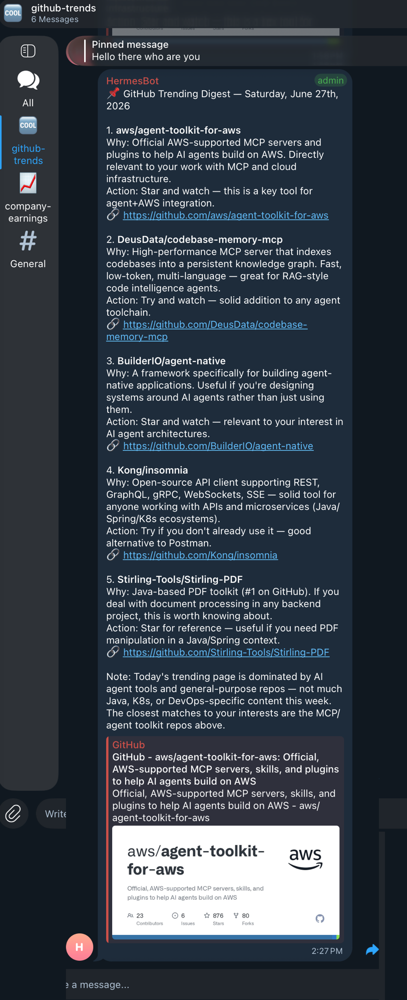
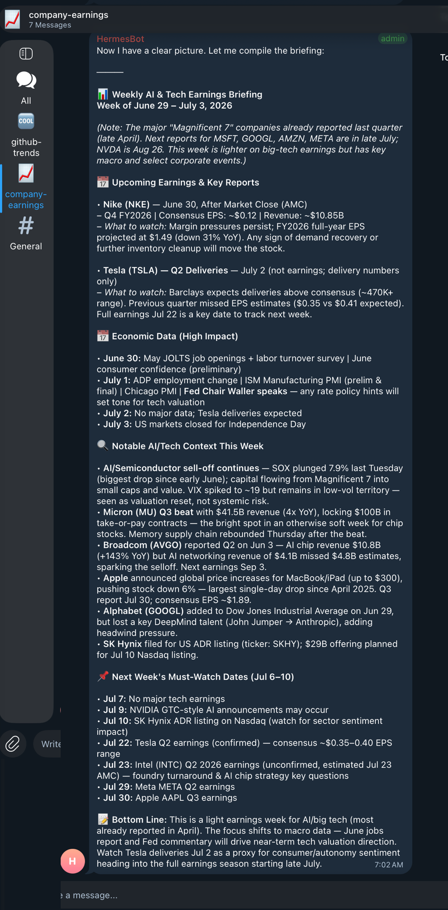

# 4. Cron Jobs — Proof It Works

The clearest sign the whole stack is alive: scheduled agent jobs that run unattended and post their
results into Telegram. Two run here, and they double as a demonstration of OpenClaw's cron system —
isolated agent turns that get their own session, run a prompt, and deliver the output to a channel.

The digest idea came from [awesome-openclaw-usecases](https://github.com/hesamsheikh/awesome-openclaw-usecases).

---

## 4.1 The two jobs

| Job | Schedule (cron) | Timezone | Model | Delivers to |
|-----|-----------------|----------|-------|-------------|
| **Daily GitHub Trends digest** | `30 9 * * *` | `Pacific/Auckland` | `ollama/qwen3.6:35b-a3b-mxfp8` | Telegram group |
| **Weekly AI & Tech Earnings** | `0 7 * * 6` | `Pacific/Auckland` | `ollama/qwen3.6:35b-a3b-mxfp8` | Same Telegram group |

`30 9 * * *` = every day at 09:30; `0 7 * * 6` = 07:00 on Saturday — both **in the job's own
timezone**, which you must set explicitly (see [§4.4](#44-gotcha-set-the-timezone-explicitly)).

Each job delivers into its own Telegram **topic** (a thread within the group — `github-trends` and
`company-earnings` in the sidebar), so the digests stay organised and don't crowd the main chat.
This is what they actually look like when they land:

| Daily GitHub Trends digest → `#github-trends` | Weekly AI & Tech Earnings → `#company-earnings` |
|:---:|:---:|
|  |  |

Both were posted by the bot on a schedule with **no human in the loop** — the agent ran the prompt,
gathered the data over the web, formatted the briefing, and announced it to the topic.

---

## 4.2 Anatomy of a cron job

A job is an `agentTurn` payload on a schedule, with a delivery target. The GitHub Trends digest:

```json
{
  "name": "Daily GitHub Trends Digest",
  "description": "Daily 09:30 Pacific/Auckland — GitHub trending repos filtered by interests",
  "schedule": {
    "kind": "cron",
    "expr": "30 9 * * *",
    "tz": "Pacific/Auckland"
  },
  "sessionTarget": "isolated",
  "payload": {
    "kind": "agentTurn",
    "message": "Fetch today's GitHub Trending repositories and deliver a filtered digest...",
    "model": "ollama/qwen3.6:35b-a3b-mxfp8",
    "timeoutSeconds": 300,
    "toolsAllow": ["web_search", "web_fetch"]
  },
  "delivery": {
    "mode": "announce",
    "channel": "telegram",
    "to": "<telegram-group-id>",
    "threadId": "<topic-thread-id>"
  }
}
```

| Field | Purpose |
|-------|---------|
| `schedule.kind` | `"cron"` (also `"every"` for intervals, `"at"` for one-shots). |
| `schedule.expr` | Standard 5-field cron expression. |
| `schedule.tz` | **IANA timezone** the `expr` is evaluated in — **set this** ([§4.4](#44-gotcha-set-the-timezone-explicitly)). |
| `sessionTarget` | `"isolated"` — runs in its own throwaway session, no chat history baggage. |
| `payload.kind` | `"agentTurn"` — runs a full agent turn with the given prompt. |
| `payload.model` | **Per-job model override** ([§4.3](#43-cron-jobs-pin-their-own-model)). |
| `payload.toolsAllow` | Restrict the isolated agent to specific tools (here, web only — no file writes, no exec). |
| `payload.timeoutSeconds` | Hard cap on the run. |
| `delivery.mode` | `"announce"` — push the result to a channel. |
| `delivery.to` / `threadId` | Target chat and (for groups with topics) the thread. |

> **Telegram group targeting:** the `to` value for a group needs the `-100` prefix
> (e.g. a group whose link shows `3760976053` is addressed as `-1003760976053`), and `threadId` is
> the topic ID visible at the end of a topic link like `t.me/c/3760976053/10` → `10`.

---

## 4.3 Cron jobs pin their own model

This is the key idea: **`payload.model` is independent of `agents.defaults.model.primary`.** Interactive
chat uses the cloud primary (DeepSeek) for quality; these background jobs pin
`ollama/qwen3.6:35b-a3b-mxfp8` so all that scheduled work runs on the **free local model** — no API
billing for routine digests.

The pinned model still has to be in the [allowlist](03-config-files.md#33-allowlist-vs-primaryfallbacks)
(`agents.defaults.models`), or the job can't select it.

> Set `payload.model` explicitly on *every* cron job. If you leave it off, the job inherits
> `model.primary` and you may quietly rack up cloud charges on scheduled runs.

---

## 4.4 Gotcha: set the timezone explicitly

Cron expressions are evaluated in `schedule.tz`. If you omit it, jobs fire in whatever default the
runtime assumes (often UTC), so a `30 9 * * *` job meant for 09:30 local can land in the middle of
the night. Always set an IANA zone:

```json
"schedule": { "kind": "cron", "expr": "30 9 * * *", "tz": "Pacific/Auckland" }
```

See [Troubleshooting §6](06-troubleshooting.md#6-cron-jobs-fire-in-the-wrong-timezone).

---

## 4.5 Managing jobs

```bash
openclaw cron list                 # all jobs
openclaw cron get <job-id>         # one job's config
openclaw cron run <job-id> --force # test it right now
openclaw cron runs <job-id>        # run history (ok / error / skipped; delivered / failed)
openclaw cron update <job-id> --enabled false
openclaw cron remove <job-id>
```

After creating or editing a job, `--force` run it once to confirm the prompt, model, tools, and
delivery target all work before trusting the schedule.

---

## 4.6 Migrating from OS crontab

The GitHub Trends digest started life as a ~100-line bash script (`github-trends-digest.sh`) driven by
the OS `crontab`: it scraped `github.com/trending` with Python, piped the result to Ollama for
filtering, and POSTed to Telegram with a **hardcoded bot token**. It worked, but:

- the bot token sat in plaintext in a shell script;
- it called the Telegram API directly, bypassing OpenClaw's delivery system;
- failures were silent (buried in a `.log` file);
- there was no retry, no model fallback, no visibility.

Migrating to an OpenClaw cron job fixed all of that:

| Aspect | OS cron | OpenClaw cron |
|--------|---------|---------------|
| Delivery | Raw Telegram API call | Managed `announce` |
| Secrets | Bot token in the script | No tokens in job config |
| Errors | Silent log files | Visible run status + retries |
| Model | Hardcoded | Per-job, swappable |
| Tools | Whatever the script shells out to | Scoped `toolsAllow` |

**Migration steps:**

1. Create the OpenClaw cron job ([§4.2](#42-anatomy-of-a-cron-job)).
2. `openclaw cron run <job-id> --force` to confirm it delivers.
3. Comment out (don't delete) the old `crontab -e` entry.
4. Run both in parallel for a few days, compare output, then remove the OS entry.

---

Next: **[5. Skills guide](05-skills.md)** · **[6. Troubleshooting](06-troubleshooting.md)**
